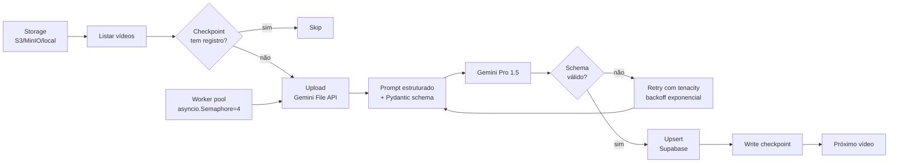

<h1 align="center">🎬 Video Metadata Pipeline Template</h1>

<p align="center">
  <strong>Pipeline async pra transcrição + extração estruturada de metadados de vídeo em batch.</strong><br/>
  <sub>Gemini File API · Pydantic · Supabase · retry idempotente.</sub>
</p>

<p align="center">
  
  
  
  
</p>

---

## 📌 O problema

Catálogos de vídeo (cursos online, fitness digital, treinamentos corporativos, mídia) tipicamente têm:

- **Metadados pobres** — apenas título, descrição livre, duração
- **Sem estrutura pra busca semântica** — não dá pra responder "vídeos de força com halteres, 15-20min, nível intermediário"
- **Sem fallback pra recomendação** — quando o motor principal falha, não sobra com o que recorrer

Extração manual de 400+ vídeos? Inviável.

## 🎯 A solução

Pipeline Python async que:

1. Lista vídeos do storage (S3/MinIO/Supabase Storage/local)
2. Sobe cada vídeo pra **Gemini File API** (lida com arquivos grandes nativamente)
3. Pede transcrição com timestamps + 12 campos estruturados via **Pydantic schema**
4. Valida resposta, retenta em falha (`tenacity`), faz checkpoint
5. Upserta resultado em tabela Supabase com `ON CONFLICT DO NOTHING`

## 🏗️ Arquitetura



## 🛠️ Stack

- **Linguagem:** Python 3.11
- **LLM:** Gemini Pro 1.5 via `google-generativeai` (File API pra arquivos > 20MB)
- **Validação:** Pydantic v2 (schema com refinements + validators)
- **Retry:** `tenacity` com backoff exponencial + jitter
- **Concorrência:** `asyncio.Semaphore` configurável (padrão 4)
- **Storage de saída:** Supabase (PostgreSQL) + tabela `video_metadata`

## 📦 O que tem nesse repo

```
.
├── src/
│   ├── pipeline/
│   │   ├── orchestrator.py         # loop principal async
│   │   ├── gemini_client.py        # wrapper File API
│   │   ├── schema.py               # Pydantic models
│   │   └── checkpoint.py           # SQLite local + Supabase remoto
│   ├── prompts/
│   │   ├── transcription.md
│   │   └── extraction.md
│   └── cli.py                      # entry point com Typer
├── tests/
│   ├── fixtures/                   # 3 vídeos mock pra teste
│   ├── test_schema.py
│   └── test_orchestrator.py
├── sql/
│   └── 001_video_metadata.sql      # schema da tabela alvo
├── docs/
│   ├── schema-rationale.md
│   └── cost-estimation.md
├── pyproject.toml
└── .env.example
```

## 📋 Schema de extração (exemplo genérico — fitness)

```python
class VideoMetadata(BaseModel):
    titulo: str
    duracao_segundos: int
    nivel: Literal["iniciante", "intermediario", "avancado"]
    foco_principal: Literal["forca", "cardio", "flexibilidade", "mobilidade", "core"]
    equipamentos: list[Equipamento]
    intensidade: Literal[1, 2, 3, 4, 5]
    grupos_musculares: list[str]
    tem_aquecimento: bool
    tem_alongamento_final: bool
    contraindicacoes: list[str]
    palavras_chave: list[str]
    transcricao_resumo: str  # max 500 chars
```

> Schema é **trocável**. Substitua por qualquer domínio (cursos, podcasts, treinamentos corporativos).

## 🚀 Como rodar

```bash
git clone https://github.com/LufeDigitalWave/video-metadata-pipeline-template
cd video-metadata-pipeline-template
uv sync   # ou pip install -e .

cp .env.example .env  # GEMINI_API_KEY, SUPABASE_URL, etc

python -m src.cli process \
  --input-dir ./videos \
  --concurrency 4 \
  --resume
```

## 📊 Resultados (caso real, anonimizado)

| Métrica | Valor |
|---|---|
| Vídeos processados | 400+ |
| Campos extraídos por vídeo | 12 |
| Tempo médio por vídeo | ~45s |
| Taxa de retry | < 3% |
| Custo total estimado | < $25 |
| Acurácia validada manualmente (amostra de 30) | > 92% |

## 🧪 Testes incluídos

- ✅ Schema válido / inválido / parcial
- ✅ Retry em rate limit (HTTP 429)
- ✅ Checkpoint resume após queda
- ✅ Vídeo > 20MB (usa File API, não inline)

## 📚 Leitura recomendada

- [docs/schema-rationale.md](docs/schema-rationale.md) — por que esses 12 campos
- [docs/cost-estimation.md](docs/cost-estimation.md) — quanto custa 1k vídeos

## 📄 Licença

MIT.
